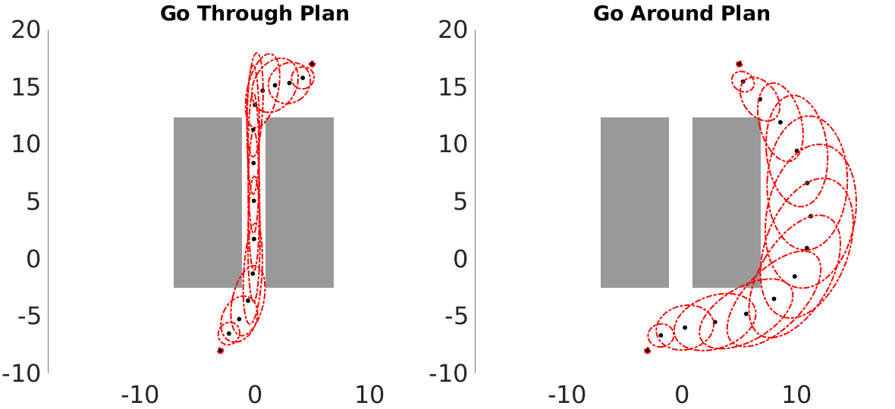

**This is the README for the project variational inference (GVI) to motion planning.**

VIMP uses the variational inference to approach the motion planning problem as a probability inference. It models the trajectories using a mean and also a covariance. This project is built upon GTSAM and GPMP2.
 * Build GTSAM: \
[GTSAM](https://github.com/borglab/gtsam)    
 * Build and installation:\
   <code> git clone https://github.com/borglab/gtsam.git \
                  mkdir build \
                  cd build \
             cmake -DGTSAM_BUILD_PYTHON:=ON -DGTSAM_BUILD_MATLAB:=ON -               DGTSAM_INSTALL_MATLAB_TOOLBOX:=ON -DGTSAM_ALLOW_DEPRECATED_SINCE_V4:=OFF -DGTSAM_INSTALL_CYTHON_TOOLBOX:=ON  -DGTSAM_USE_SYSTEM_EIGEN:=ON .. \
             sudo make install 
   </code> 
   [GPMP2](https://github.com/gtrll/gpmp2)
  * Build and installation:\
   <code>
             git clone https://github.com/gtrll/gpmp2.git \
              mkdir build \
              cd build \
              cmake -DGPMP2_BUILD_PYTHON_TOOLBOX:=ON -DGPMP2_BUILD_MATLAB_TOOLBOX:=ON .. \
              sudo make install 
   </code>
 * Usage: \
        After creating the neccessary ROS environments and installation of moveit
   * run the rviz world: 
        <code> roslaunch panda_moveit_config demo.launch pipeline:=ompl-chomp </code>
   * adding obstacles:
        <code> python ~/ws_moveit/src/moveit_collect_data/scripts/collision_scene.py </code>

   * start the data listener:
        <code> python ~/ws_moveit/src/moveit_collect_data/scripts/collect_data.py </code>
   * start sampling node:
        <code> rosrun moveit_collect_data random_sampling </code>